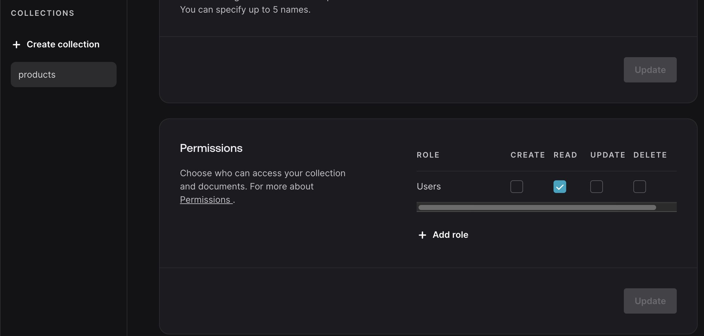

# SSR Auth flow using Appwrite node SDK

## Login Page

Checks if there is already a user session. if so, redirects auth user to protected page using the ```getUser``` method from **auth.js**.

when form is submitted, the ```createSession``` method 
- store's the session in a cookie safely in the browser. 
- creates the account in appwrite DB.
- redirects user to protected page

## Header Component
Gets the current user, again using ```getUser```. When a user logs out, the ```deleteSession``` method removes session from cookie and from Appwrite.  


## Protected Route
uses axios to fetch data from Appwrite DB, passing along the session cookie with the request. (see ```axiosinstance.js```) The session cookie needs to be passed in on every request, to ensure only auth users are making requests to DB. 


## Additional Notes

- **Middleware.js** checks for auth user (```getUser```) before routing to requested page
- Inside Appwrite DB, grant authenticated users permission to either Read, Write, Update or delete collections. If not, a 403 error will occur saying user doesn't have permission to access that collection.
*see image*



